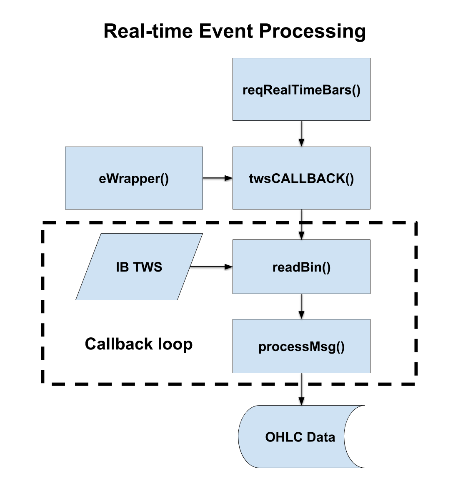

### Overview

The package *IBrokers2* executes real-time trading strategies using the functions from package *IBrokers* plus some additional functions. The additional functions mostly provide trade execution capabilities, for running systematic trading strategies. For example, the original function *IBrokers::reqRealTimeBars()* can be used for running trading strategies, by passing to it a customized *event wrapper* (*eWrapper*) function called *IBrokers2::trade\_wrapper()*.

### Implementation Details

The function *IBrokers::reqRealTimeBars()* collects real-time bar data (*OHLC* data) from Interactive Brokers and saves it to a file. It relies on an *eWrapper* function to write each bar of *OHLC* data. An *eWrapper* is an *R* environment which contains variables and handler functions, and serves as a buffer for the streaming real-time market data. An *eWrapper* function creates an *eWrapper* environment, defines its member (handler) functions, and returns the *eWrapper* environment.

The function *IBrokers::reqRealTimeBars()* calls *IBrokers::twsCALLBACK()*, which first creates an *eWrapper* environment by calling an *eWrapper* function, and then passes the *eWrapper* environment into *IBrokers::processMsg()* and calls it in a callback loop. The callback loop is performed inside the function *IBrokers::twsCALLBACK()*, which calls *IBrokers::processMsg()* in a loop, which in turn calls *realtimeBars()* (defined inside *IBrokers2::trade\_wrapper()*). The function *IBrokers::processMsg()* calls the data handlers in the *eWrapper* environment to process and save each bar of the *OHLC* data. This way the *eWrapper* environment created by *IBrokers2::trade\_wrapper()* persists as a *mutable state* in the evaluation environment of the function *twsCALLBACK()*, in between bar data arrivals.

The function *IBrokers2::trade\_wrapper()* is an *eWrapper* function which is customized for trading. It creates an *eWrapper* environment, defines the member function *realtimeBars()*, and returns the *eWrapper* environment. The function *realtimeBars()* is where the trading code resides. The trading code updates a trading model with new data, runs the model, and then executed trades based on its output. The function *IBrokers2::trade\_wrapper()* is derived from the function *IBrokers::eWrapper.RealTimeBars.CSV()*.



An example of a simple trading strategy can be run with the code in the file *IB\_scripts.R* in the *scripts* sub-directory. The user can customize this strategy by modifying the trading code in *realtimeBars()*.

### System Architecture

The Interactive Brokers API uses numerical codes to indicate the type of messages and the data that are being transmitted. *IBrokers* maintains several named lists with the numerical IB codes, called: *.twsIncomingMSG*, *.twsOutgoingMSG*, *.twsTickType*, and *.twsOrderID*. The variable *curMsg* is the value returned by *readBin()*. The variable *curMsg* is parsed by comparing it with the elements of *.twsIncomingMSG*. The list *.twsOutgoingMSG* is used to create strings for outgoing messages, which are then passed into *writeBin()*.

### Installation and Loading

Install package *IBrokers2* from github:

``` r
if (!("package:devtools" %in% search() || require("devtools", quietly=TRUE)))
    install.packages("devtools")
devtools::install_github(repo="algoquant/IBrokers2")
library(IBrokers2)
```

<br>
