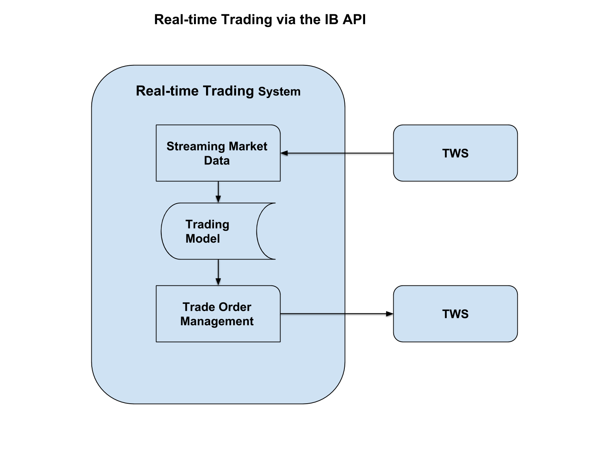
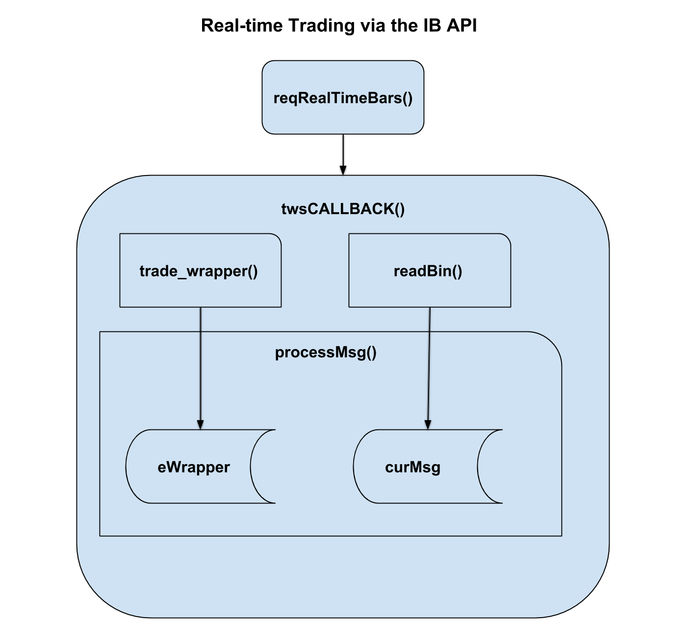

### Executing Real-time Trading Strategies

Real-time trading means trading in a programmatic loop, in which continuous streaming market data is used to update a trading model, and the model outputs are used by an order management system to place trade orders via an API. Real-time trading is fully automated, with the only human intervention being to turn the system on and off. Real-time trading is *systematic* because trading decisions are made by a trading model, not by discretionary human traders.



Real-time trading requires three components: acquisition of streaming market data and account data, trading model execution, and trade order management.

### Real-time Trading Using The Package *IBrokers2*

The package <a href="https://github.com/algoquant/IBrokers2" target="_blank"><em>IBrokers2</em></a> contains *R* functions for executing real-time trading via the <a href="https://interactivebrokers.github.io/tws-api/" target="_blank">API of Interactive Brokers (IB API)</a>. The package *IBrokers2* is derived from package <a href="https://cran.r-project.org/web/packages/IBrokers/index.html" target="_blank"><em>*IBrokers*</em></a>, and is fully backward compatible with it. This means that all the *IBrokers* functions and variables are preserved exactly in *IBrokers2*, while some additional functions have been added. The additional functions in *IBrokers2* provide functionality for the three components required for real-time trading.

*IBrokers2* adapts some of the functions from *IBrokers*, to enable real-time trading capabilities. For example, the original function *IBrokers::reqRealTimeBars()* is used for running trading strategies, by passing to it a customized *event wrapper* (*eWrapper*) function called *IBrokers2::trade\_wrapper()*.

The function *IBrokers::reqRealTimeBars()* collects real-time bar data (*OHLC* data) from Interactive Brokers in a callback loop, and saves it to a file. Interactive Brokers by default only offers 5-second bars of *real-time* prices and volumes (but also offers *historical* data at other frequencies). The function *IBrokers::reqRealTimeBars()* relies on an *eWrapper* environment to process and save each bar of *OHLC* data. An *eWrapper* environment is an *R* environment containing data, variables, and handler (accessor) functions. *eWrapper* environments serve as a buffer for saving the streaming real-time market data. An *eWrapper* function creates an *eWrapper* environment. The standard *eWrapper* function for acquiring real-time bar data is *IBrokers::eWrapper.RealTimeBars.CSV()*. This function can be modified to perform real-time trading.

The function *IBrokers::reqRealTimeBars()* calls *IBrokers::twsCALLBACK()*, which first creates an *eWrapper* environment by calling an *eWrapper* function, and then passes the *eWrapper* environment into *IBrokers::processMsg()* and calls it in a callback loop. The function *IBrokers::processMsg()* calls the data handlers in the *eWrapper* environment to process and save each bar of the *OHLC* data. This way the *eWrapper* environment created by *IBrokers2::trade\_wrapper()* persists as a *mutable state* in the evaluation environment of the function *twsCALLBACK()*, in between bar data arrivals.



The callback loop is performed inside the function *IBrokers::twsCALLBACK()*, by calling *IBrokers::processMsg()* in a loop, which in turn calls function *realtimeBars()* (defined inside *IBrokers2::trade\_wrapper()*).

The function *IBrokers2::trade\_wrapper()* is an *eWrapper* function derived from the function *IBrokers::eWrapper.RealTimeBars.CSV()*, which is customized for trading. It creates an *eWrapper* environment, defines the member function *realtimeBars()*, and returns the *eWrapper* environment. The function *realtimeBars()* is where the trading code resides. The trading code updates a trading model with new data, runs the model, and then executed trades based on its output.

An example of a simple trading strategy can be run with the code in the file *IB\_scripts.R* in the *scripts* sub-directory. The user can customize this strategy by modifying the trading code in the function *model\_fun()*, inside function *trade\_wrapper()*.

### System Architecture

The Interactive Brokers API uses numerical codes to indicate the type of messages and the data that are being transmitted. *IBrokers* maintains several named lists with the numerical IB codes, called: *.twsIncomingMSG*, *.twsOutgoingMSG*, *.twsTickType*, and *.twsOrderID*. The variable *curMsg* is the value returned by *readBin()*. The variable *curMsg* is parsed by comparing it with the elements of *.twsIncomingMSG*. The list *.twsOutgoingMSG* is used to create strings for outgoing messages, which are then passed into *writeBin()*.

### Installation and Loading

Install package *IBrokers2* from github:

``` r
if (!("package:devtools" %in% search() || require("devtools", quietly=TRUE)))
    install.packages("devtools")
devtools::install_github(repo="algoquant/IBrokers2")
library(IBrokers2)
```

<br>
